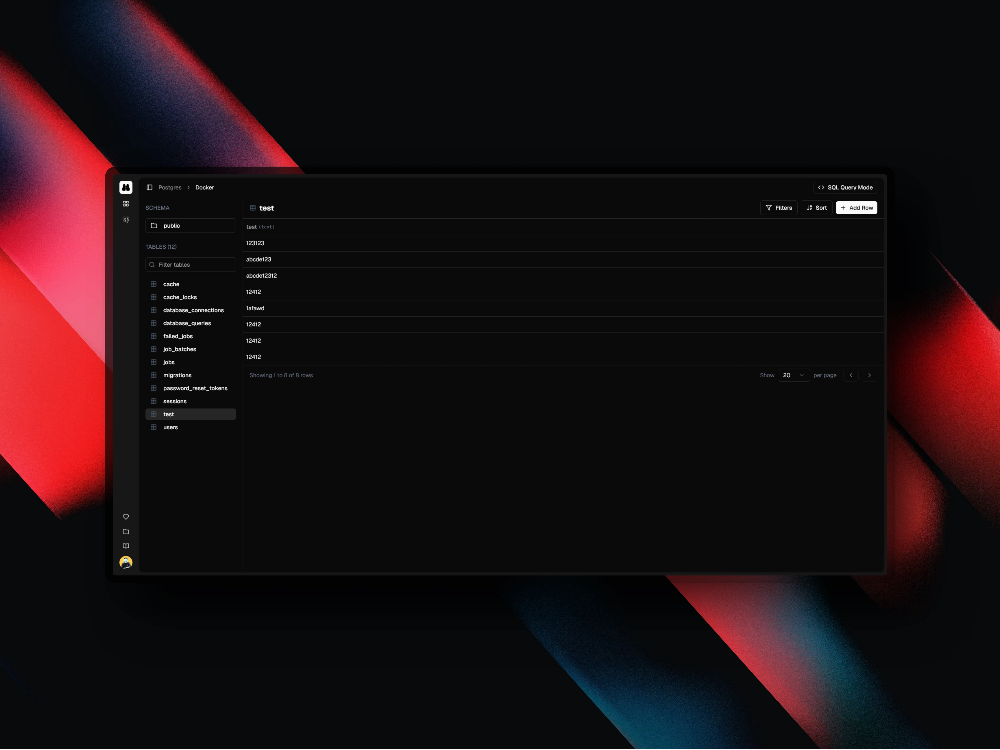

# Peeper
The operating system for your data.

## Status
Peeper is currently in alpha development. Guides and documentation are coming soon.

## Features
- [x] Add and manage your databases.
- [x] Query your databases with a SQL editor and view history.
- [x] Visualize your data with a data viewer.
- [ ] Export your data to a file.
- [ ] Import your data from a file.
- [ ] Add and manage your storage providers.
- [ ] Upload and download files to your storage providers.
- [ ] Multi-tenancy with role-based access control.
- [ ] SSO with relevant providers.
- [ ] 2 Factor Authentication

## Supported Databases
- [x] Postgres
- [ ] SQLite (including Turso and other LibSQL providers)
- [ ] MySQL
- [ ] Redis

## Supported Storage Providers
- [ ] AWS S3
- [ ] Hetzner Object Storage
- [ ] Digital Ocean Spaces
- [ ] Cloudflare R2
- [ ] Wasabi
- [ ] Minio
- [ ] Other (Custom)

## Preview

# License
Peeper is licensed under the [AGPL 3.0](LICENSE).
